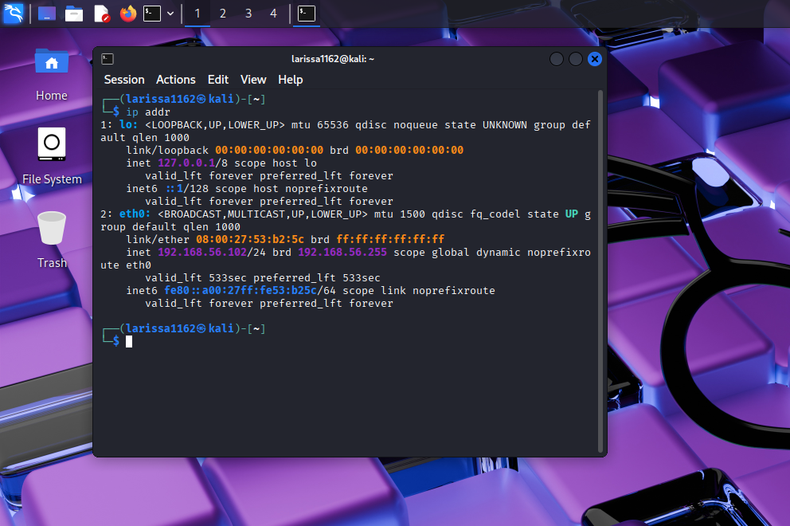

# Desafio DIO de Segurança Cibernética: Ataques de Força Bruta com Kali Linux

## Descrição do Projeto

Este repositório apresenta a documentação referente ao Desafio de Projeto em Segurança Cibernética proposto pela Digital Innovation One (DIO). O objetivo do estudo consiste em simular e analisar cenários de ataques de força bruta (Brute Force) em um ambiente controlado e isolado, com o propósito de compreender suas dinâmicas e avaliar medidas de mitigação eficazes.

O laboratório foi composto por uma máquina atacante (Kali Linux) e por alvos vulneráveis (Metasploitable2 e DVWA), interconectados em uma rede isolada configurada por meio do VirtualBox. Foram realizados testes direcionados a serviços comumente explorados, como FTP, SMB e formulários web, empregando ferramentas especializadas de força bruta, tais como Hydra e Medusa.

A documentação inclui a configuração do ambiente, wordlists e comandos utilizados, evidências dos testes (capturas de tela), além de análises e recomendações de mitigação, como bloqueio por tentativas, rate limiting, MFA, políticas de senha e monitoramento contínuo.

>⚠️ Aviso Ético-Legal: Todos os procedimentos, comandos e evidências deste repositório foram realizados em máquinas virtuais isoladas e destinam-se exclusivamente a fins educacionais, de pesquisa e auditoria interna. As máquinas e aplicações-alvo utilizadas (como Metasploitable2 e DVWA) são intencionalmente vulneráveis, permitindo a prática segura de técnicas de segurança ofensiva.
>
>O escopo das atividades foi estritamente limitado às máquinas virtuais descritas. Não houve varredura, exploração ou coleta de dados em sistemas ou redes de terceiros. A reprodução ou aplicação das técnicas aqui documentadas em sistemas sem autorização por escrito constitui ato ilícito, sujeito a responsabilização legal.

## Ferramentas e Tecnologias Utilizadas

A seguir estão descritas as principais tecnologias e ferramentas empregadas no laboratório e nos procedimentos experimentais.

| **Ferramenta / Tecnologia** | **Função principal** | **Uso no laboratório** |
|-----------------------------|----------------------|------------------------|
| VirtualBox                  | Virtualização        | Plataforma de virtualização utilizada para criar, importar e gerir as VMs do laboratório (Kali e Metasploitable2). Suporta host-only/internal networks e snapshots para preservar estados. |
| Kali Linux                  | Plataforma atacante  | Sistema operacional atacante com suíte de ferramentas de pentest (hydra, medusa, nmap, etc.). |
| Metasploitable2             | Máquina alvo vulnerável | VM propositalmente vulnerável utilizada como alvo para testes de serviços e exploração. |
| DVWA                        | Aplicação web vulnerável | Aplicação alvo para testes de formulários, autenticação e ataques de força bruta. |
| Medusa                      | Brute force automatizado | Ferramenta para ataques automatizados a serviços (ex.: FTP, SMB, SSH) durante os testes. |
| Hydra                       | Brute force & HTTP forms | Ferramenta para força bruta em serviços e formulários web (HTTP form-post), usada como alternativa ao Medusa. |
| Nmap                        | Varredura e descoberta de rede | Mapeamento de hosts, portas e versões de serviços (fingerprinting e scripts de descoberta). |
| enum4linux                  | Enumeração SMB       | Coleta de informações SMB (shares, usuários, SIDs) para avaliação de superfície SMB. |
| smbclient                   | Cliente SMB          | Acesso e testes de autenticação em shares SMB; verificação prática de permissões. |
| Wordlists (ex.: users.txt, passwords.txt) | Base para ataques | Listas de usuários e senhas usadas nas tentativas de força bruta. |


## Links oficiais para download

| Ferramenta / Tecnologia | Versão | Link                                                                          |
| ----------------------- | -----: | ----------------------------------------------------------------------------- |
| VirtualBox              |  7.2.2 | [virtualbox.org](https://www.virtualbox.org/)                                 |
| Kali Linux              | 2025.3 | [kali.org](https://www.kali.org/get-kali/#kali-platforms)                     |
| Metasploitable 2        |     v2 | [Metasploitable2](https://sourceforge.net/projects/metasploitable/files/Metasploitable2/) |

As demais ferramentas utilizadas neste laboratório são fornecidas por padrão nas imagens oficiais do Kali Linux. Se, por algum motivo, estiverem ausentes ou se preferir reinstalá‑las, é possível instalar/atualizar essas ferramentas diretamente pelo terminal do Kali com o gerenciador de pacotes ```apt```. 

```bash
sudo apt update && sudo apt install -y hydra medusa nmap enum4linux smbclient
```

Após a instalação, é possível verificar as versões e a disponibilidade dos ferramentas executando:
```bash
hydra -V    # ou hydra --version
medusa -V   # ou medusa --version
nmap -V     # ou nmap --version
```

## Configuração do Ambiente

### Instalação do VirtualBox, criação das VMs (Kali, Metasploitable2) e preparo da rede Host-Only

Esta seção apresenta os procedimentos e parâmetros adotados para a configuração do ambiente virtual utilizado no laboratório, incluindo o registro detalhado das configurações e etapas realizadas.

A seguir apresentam‑se instruções reprodutíveis que permitem criar um laboratório semelhante ao utilizado neste projeto, com Kali Linux (atacante), Metasploitable2 (alvo) e uma rede Host‑Only dedicada.

### A. Instalar o VirtualBox
1. Acesse o site oficial do VirtualBox.
2. Baixe o instalador adequado ao seu sistema (Windows / macOS / Linux).
3. Execute o instalador clicando duas vezes no arquivo baixado. Em seguida, siga as instruções do assistente e aceite a instalação dos drivers de rede e extensões quando solicitado.
4. Finalize e, se solicitado, reinicie o computador.
5. Abra o VirtualBox e confirme a interface.

<div align="right">
  <details>
    <summary font-weight: bold;>
      [Interface VirtualBox]
    </summary>
    
  </details>
</div>

### B. Criar a VM Kali (a partir da ISO)
1. Acesse o site oficial do Kali Linux.
2. Faça o download da imagem ISO recomendada.
3. No VirtualBox clique em New.
4. VM Name: Kali → ISO Image: selecione a ISO do Kali baixada → OS: Linux → OS Distribution: Debian → OS Version: Debian (64-bit) → Next.

<div align="right">
  <details>
    <summary font-weight: bold;>
      [Configuração VM Kali]
    </summary>
    
  </details>
</div>

5. Para o uso neste laboratório, manteremos as especificações de hardware virtual recomendadas pelo próprio sistema.

<div align="right">
  <details>
    <summary font-weight: bold;>
      [Hardware VM Kali]
    </summary>
    
  </details>
</div>

6. Na página seguinte, verifique se todas as especificações estão corretas e finalize a configuração da máquina virtual.
7. Selecione a VM criada e clique em Start para iniciar a VM e executar o instalador do Kali.
8. Instale o Kali normalmente pelo instalador gráfico. Selecione o idioma e a região de preferência, defina um usuário e uma senha que serão utilizados posteriormente. Para este laboratório, não é necessário criar partições de armazenamento.

<div align="right">
  <details>
    <summary font-weight: bold;>
      [Instalador Kali Linux]
    </summary>
    
  </details>
</div>

9. A instalação pode levar alguns minutos. Após concluída, o Kali estará pronto para uso.

### C. Criar a VM Metasploitable2 (a partir do VMDK)

1. Acesse o site indicado, faça o download e extraia os arquivos contidos na pasta.
2. No VirtualBox clique em New.
3. VM Name: Metasploitable → OS: Linux → OS Distribution: Other Linux → OS Version: Other Linux (32-bit) → Next.

Observação: para esta VM, não selecionaremos nenhum arquivo em ISO Image.

<div align="right">
  <details>
    <summary font-weight: bold;>
      [Configuração VM Metasploitable2]
    </summary>
    
  </details>
</div>

4. Mais uma vez, para o uso neste laboratório, manteremos as especificações de hardware virtual recomendadas pelo próprio sistema.

<div align="right">
  <details>
    <summary font-weight: bold;>
      [Hardware VM Metasploitable2]
    </summary>
    
  </details>
</div>

5. Na página seguinte, verifique se todas as especificações estão corretas e finalize a configuração da máquina virtual.
6. Selecione a VM criada → Settings → System → Motherboard → em Boot Order deixe apenas Hard Disk marcado (desmarque Floppy/Optical).

<div align="right">
  <details>
    <summary font-weight: bold;>
      [Boot VM Metasploitable2]
    </summary>
    
  </details>
</div>

7. Settings → Storage → selecione o disco VDI criado automaticamente e clique no ícone de remoção (ícone com um X vermelho) para remover o disco temporário.

<div align="right">
  <details>
    <summary font-weight: bold;>
      [Remoção disco VDI temporário]
    </summary>
    
  </details>
</div>

8. Ainda em Storage, clique no ícone Add Hard Disk (ícone com um + verde ao lado do controlador SATA) → Choose existing disk... → navegue até o .vmdk extraído → Open → Choose.

<div align="right">
  <details>
    <summary font-weight: bold;>
      [Adição disco VMDK]
    </summary>
    
  </details>
</div>

<div align="right">
  <details>
    <summary font-weight: bold;>
      [Configuração de armazenamento 3]
    </summary>
    
  </details>
</div>

9. Clique em OK e inicie a VM. Login: msfadmin → Password: msfadmin.

### D. Configuração da Rede Host-Only

Para cada VM (Kali Linux e Metasploitable):

1. Selecione a VM → Settings → Expert → Network.
2. Em Adapter 1, marque Enable Network Adapter.
3. Em Attached to, escolha Rede somente do hospedeiro (Host-Only Adapter).

<div align="right">
  <details>
    <summary font-weight: bold;>
      [Configuração Rede Host-Only]
    </summary>
    
  </details>
</div>

4. Certifique-se de que não há outros adaptadores habilitados.
5. Salve as configurações e inicie as máquinas.

### E. Validação dos Endereços IP
#### Kali Linux
1. Abra o terminal e execute: 

```bash
ip addr
# ou, se preferir:
ifconfig
```
2. Localize o IP associado à interface do Host-Only (ex.: eth1, eth0 ou enp0s8).
3. IP esperado: algo na faixa 192.168.56.X (ex.: 192.168.56.102).

<div align="right">
  <details>
    <summary font-weight: bold;>
      [IP Kali Linux]
    </summary>
    
  </details>
</div>

#### Metasploitable2

1. Faça login na VM e execute:

```bash
ip addr
# ou, se preferir:
ifconfig
```
2. Localize o IP associado à interface do Host-Only (geralmente eth0).
3. IP esperado: algo na faixa 192.168.56.Y (ex.: 192.168.56.101).

<div align="right">
  <details>
    <summary font-weight: bold;>
      [IP Metasploitable2]
    </summary>
    
  </details>
</div>

### F. Teste de Conectividade

1. A partir do terminal do Kali, teste a comunicação com o Metasploitable:

```bash
ping -c 3 192.168.56.101
```
2. Resultado esperado: 3 respostas (ex.: 64 bytes from 192.168.56.101: ...) e 0% packet loss.
3. Se o ping não responder: verifique se ambas as VMs estão conectadas ao mesmo Host-Only Adapter e confirme os IPs anotados.

<div align="right">
  <details>
    <summary font-weight: bold;>
      [Teste de conectividade Kali → Metasploitable]
    </summary>
    
  </details>
</div>

## Enumeração de Serviços (Reconhecimento Ativo)

Antes de proceder ao ataque de força bruta, identificaram‑se os serviços ativos no sistema alvo. Para este exercício, realizou‑se uma varredura focalizada que confirmou a presença do serviço FTP (porta 21) no Metasploitable2. O propósito desta etapa foi verificar se o FTP estava ativo e apto a aceitar conexões, além de mapear a presença e a disponibilidade de outros serviços comumente explorados em alvos vulneráveis.
